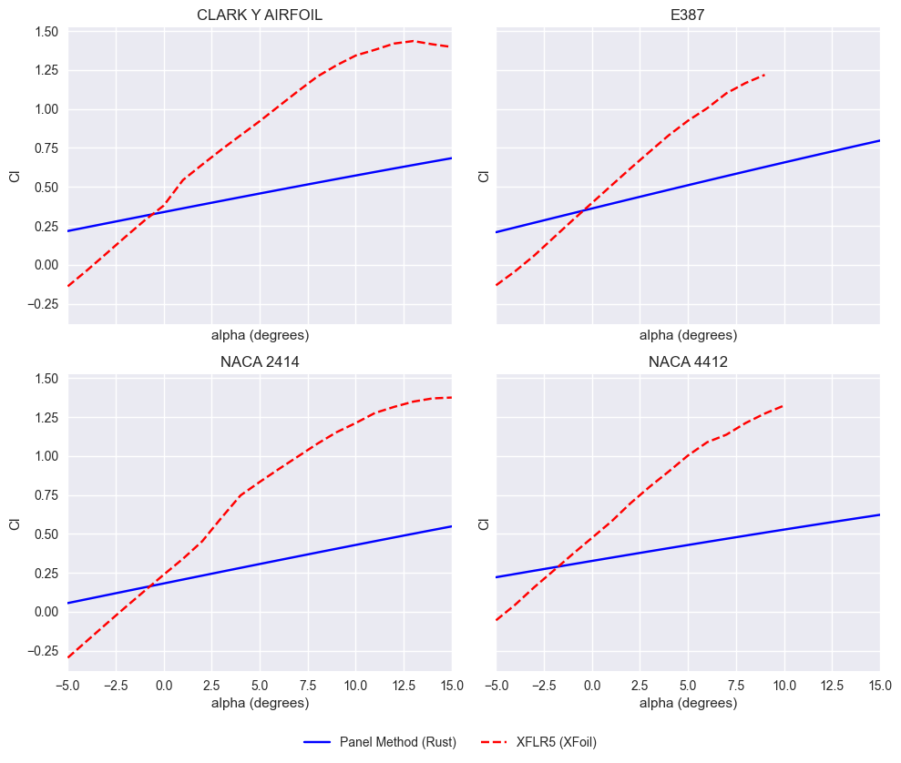
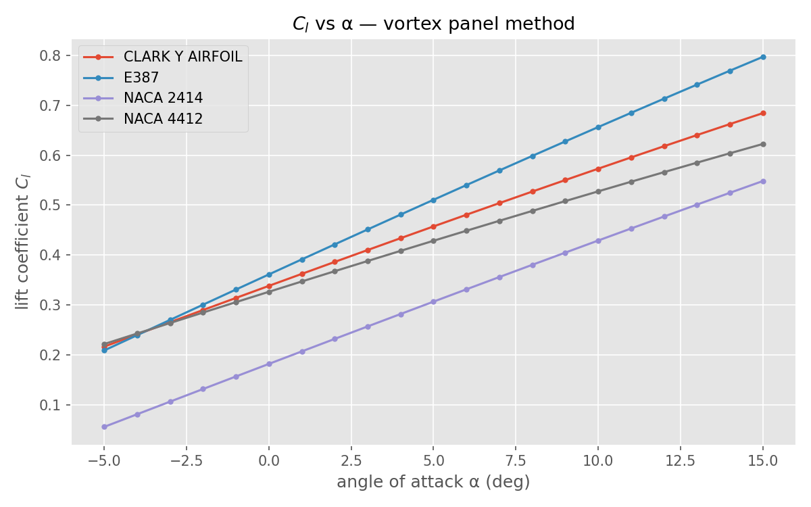
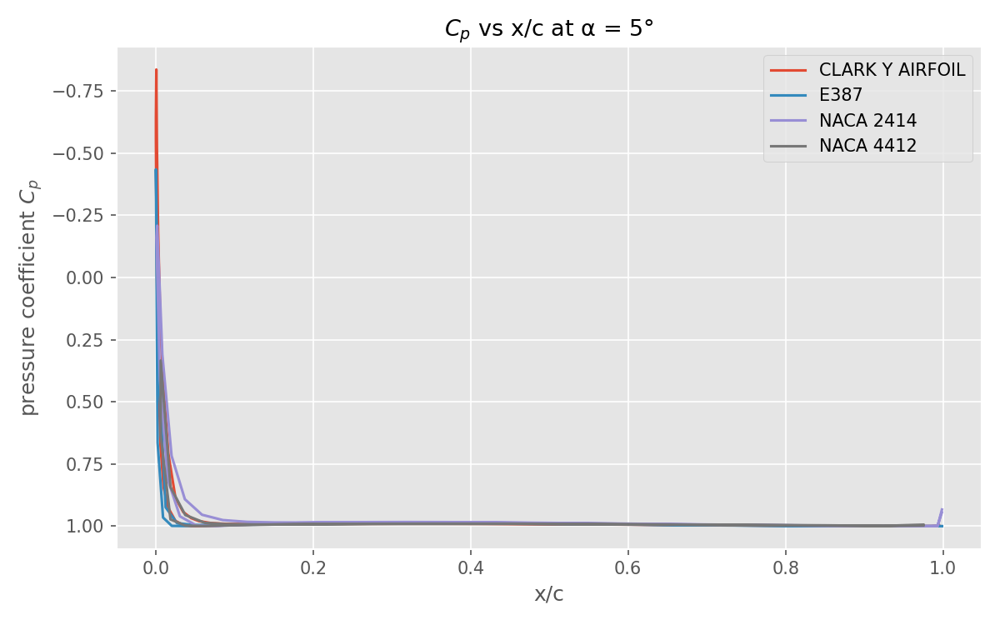

# airfoil-sim


Implements a 2D inviscid vortex panel method to compute lift coefficient (Cl) and pressure distribution (Cp) over airfoil geometries loaded from UIUC .dat files. Results are compared against XFLR5/XFoil viscous analysis.

## Demo

<p align="center">
  
  
  <br/>
  
</p>

## The Math

The vortex panel method models the flow around an airfoil by distributing vortex sheets along the geometry surface.

### Governing Equations
The flow is assumed to be ideal, irrotational, and incompressible, which allows it to be governed by the **Laplace equation**:

```math
\nabla^2 \phi = 0
```
Because the Laplace equation is linear, we can use the **superposition of elementary flows**. The total flow field is modeled as the sum of a uniform freestream and the disturbance caused by a continuous vortex sheet distributed along the airfoil surface.

### Boundary Conditions
1. **No-penetration condition**: The flow cannot pass through the airfoil surface. The normal velocity component at the surface must be zero.
2. **Kutta condition**: At the trailing edge, the flow must leave smoothly, meaning the pressure must be equal on the upper and lower surfaces at the trailing edge. This implies the net vortex strength at the trailing edge is zero:
   ```math
   \gamma_1 + \gamma_N = 0
   ```

### Influence Coefficient Matrix
The continuous vortex sheet is discretized into $N$ linear panels. We define an influence coefficient matrix $A_{ij}$, where each element represents the velocity induced by the $j$-th panel at the control point of the $i$-th panel. 

The normal and tangential influence coefficients ($A_{ij}$ and $B_{ij}$ respectively) relate the vortex strengths $\gamma_j$ to the boundary conditions:
```math
\sum_{j=1}^{N} A_{ij} \gamma_j = -\vec{V}_\infty \cdot \hat{n}_i \quad \text{for } i = 1 \dots N-1
```
The last row of $A$ enforces the Kutta condition:
```math
\gamma_1 + \gamma_N = 0
```

### Solving for Vortex Strengths
This forms a linear system $A\gamma = b$, where:
- $A$ is the $(N+1) \times (N+1)$ influence matrix (with Kutta condition).
- $\gamma$ is the vector of unknown panel vortex strengths.
- $b$ is the vector of normal freestream velocity components.

This system is solved using **LU decomposition**.

### Pressure and Lift Coefficients
Once $\gamma_i$ are found, the tangential velocity $V_i$ on each panel is simply the local vortex strength $V_i = \gamma_i$.
The pressure coefficient $C_p$ is calculated using Bernoulli's equation:
```math
C_{p,i} = 1 - \left( \frac{V_i}{V_\infty} \right)^2
```
The total lift coefficient $C_l$ is found by integrating the pressure distribution or, equivalently via the Kutta-Joukowski theorem, by summing the vortex strengths:
```math
C_l = \sum_{i=1}^{N} \gamma_i l_i
```

## File Structure

- `src/main.rs`: Entry point for the simulation. Runs the panel method over a range of angles of attack.
- `src/normalize.rs`: Utility binary to normalize Lednicer coordinates to a unit chord and correct ordering.
- `src/panel_method.rs`: Core implementation of the 2D vortex panel method, influence coefficients, and LU solver.
- `src/parser.rs`: Handles parsing of airfoil coordinate files in Selig and Lednicer formats.
- `src/airfoil.rs`: Data structures for airfoil geometry and panel discretization.
- `src/results.rs`: Data structures for storing and exporting simulation results ($C_p$, $C_l$, etc.).
- `plot.py`: Python script for generating $C_p$ vs $x/c$ and $C_l$ vs $\alpha$ plots.
- `xflr5_plot.py`: Python script for generating comparison plots against XFLR5 data.
- `data/`: Directory containing input airfoil geometry files (`.dat`).
- `output/`: Directory where the Rust simulation outputs CSV results.
- `plots/`: Directory where Python scripts save the generated plots.

## How to Run

1. **Place airfoil data**: Put your airfoil `.dat` coordinate files in the `data/` directory.

2. **Normalize (if Lednicer format)**: If using Lednicer format files, they must be normalized first:
   ```bash
   cargo run --bin normalize -- <input> <output>
   ```

3. **Run Simulation**:
   ```bash
   cargo run --release
   ```
   The simulation will process the airfoils and output CSV files to the `output/` directory.

4. **Generate Plots**:
   ```bash
   python3 plot.py
   ```
   Plots will be saved to the `plots/` directory.

## Airfoils Tested

| Airfoil | Format | Panels | Cl at 0° | dCl/dα |
| :--- | :--- | :--- | :--- | :--- |
| CLARK Y | Lednicer | 120 | 0.338 | ~0.024/deg |
| E387 | Selig | 60 | 0.361 | ~0.031/deg |
| NACA 2414 | Selig | 60 | 0.182 | ~0.025/deg |
| NACA 4412 | Selig | 34 | 0.326 | ~0.021/deg |

## Comparison with XFLR5

The inviscid vortex panel method was compared against XFLR5 viscous analysis:

- **Where they agree**: The lift curve slope ($dC_l/d\alpha$) matches very well in the linear region (from -5° up to ~9°).
- **Where they diverge**: 
  - $C_l$ Offset: The zero-lift angle of attack ($\alpha_{L=0}$) is offset by approximately 3–4°.
  - Magnitude: The predicted $C_l$ magnitude is generally lower than the XFoil viscous prediction.
  - No Stall: The panel method predicts linear lift increase indefinitely, completely failing to capture stall.
- **Why**: The panel method is fundamentally **inviscid**. It models potential flow, meaning there is no boundary layer, no flow separation, and no viscous drag. Without boundary layer displacement thickness, the effective camber seen by the flow differs, causing the offset in zero-lift alpha.

## Limitations

- **No stall prediction**: Ideal flow has no separation, so lift continues to increase linearly with angle of attack.
- **Zero-lift alpha offset**: The boundary layer displacement effect on the Kutta condition is not fully captured.
- **No drag**: By definition in inviscid flow (d'Alembert's paradox), profile drag is zero ($C_d = 0$).
- **No Reynolds number effect**: The method is scale-independent.
- **2D only**: Does not account for spanwise effects.
- **Strict Formatting**: Lednicer format requires pre-normalization via the `normalize` binary before running the simulation.

## When is this useful?

- **Quick $C_l$ vs $\alpha$ sweep** before running expensive CFD simulations.
- **Educational tool** to understand potential flow theory.
- **Validating airfoil coordinate files** for smoothness and correct paneling.
- **Comparing geometry effects** between different airfoils (the relative ranking of $C_l$ is generally correct even if the absolute values are offset).
